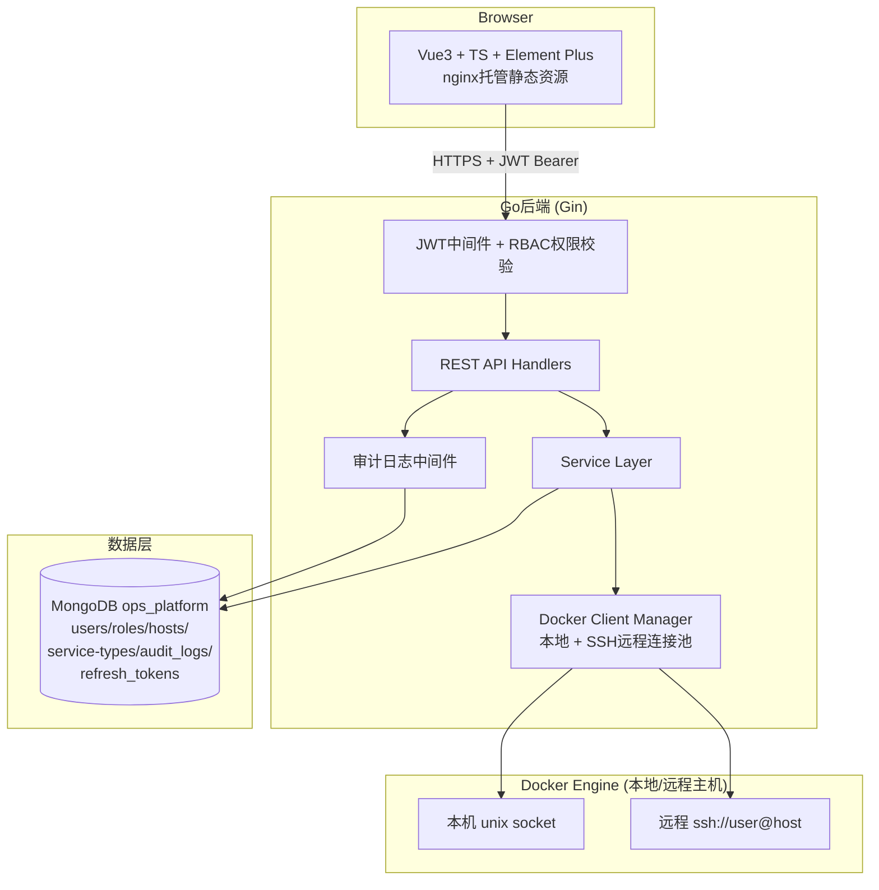
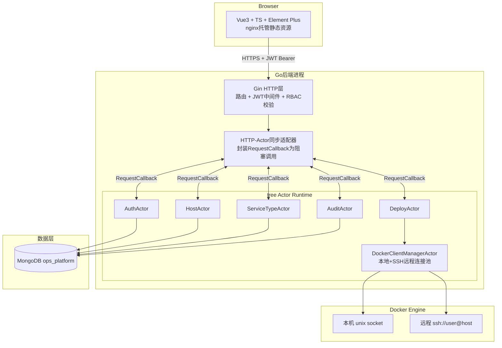

## Kiro

Transform any idea into fully working code. What do you want to build today?

## User

分析当前ops项目，我希望把这个项目用go重写，前端用vue3 ts,

## Kiro

这是一个不小的项目(server.py 17K，index.html 42K)。让我先读一下核心文件了解现状。

`ops` 文件读取失败（可能是二进制或非UTF-8的shell脚本），让我用shell命令查看它是什么类型，以及 index.html 的结构概览。

現在了解全貌了。这是一个纯原生JS + 原生HTML/CSS的单页面（无框架），后端是零依赖Python标准库HTTP服务器。核心功能：登录鉴权、多主机管理（SSH）、docker容器服务的启动/停止/部署/回滚、状态/资源统计、日志查看、容器详情查看。底层通过调用本地 `ops` bash 脚本（可SSH到远程执行）来操作 docker。

我总结一下我的理解：**你希望把这套"游戏服务器docker运维面板"从当前的 Python标准库HTTP服务器 + 原生JS前端，重写为 Go后端 + Vue3(TypeScript)前端，功能保持一致（登录鉴权、多主机管理、服务启停/部署/回滚、状态/资源监控、日志/详情查看）。**

在开始前我有几个问题：

**1. 后端与底层 `ops` 脚本的关系？**
a. **保留 shell 脚本** - Go 后端继续像现在这样 fork/exec 本地的 `ops` bash 脚本（含 SSH 远程执行逻辑），只是把 HTTP server 部分从 Python 换成 Go，改动面小、风险低
b. **用 Go 原生重写 docker 操作** - 用 Go 的 Docker SDK（或直接 SSH+docker CLI）重新实现 start/stop/deploy/rollback/status/stats/logs/inspect 等逻辑，抛弃 bash 脚本，更彻底但工作量更大，且需要重新处理远程 SSH 多主机场景
c. **其他** - 请说明你的想法

**2. 部署/运行方式有何要求？**
a. **单二进制 + 静态资源嵌入**（Go embed 打包前端dist，一个可执行文件启动即可，和现在的部署习惯最接近）
b. **前后端分离部署**（Go 只提供API，前端单独用 nginx/静态服务器托管，需要处理跨域）
c. **其他/无特殊要求**

**3. 鉴权与会话方式是否需要变化？**
a. **保持现状**（口令登录 + HttpOnly Cookie session，内存存储，重启后会话失效）
b. **升级为更严谨的方案**（例如 JWT、支持多用户/角色、会话持久化到文件或数据库等）
c. **其他/暂不确定，按你的建议来**

## User

用 Go 原生重写 docker 操作 前后端分离部署 升级为更严谨的方案

## Kiro

明确了三个关键决策：Go原生实现docker操作（弃用bash脚本）、前后端分离部署、升级为更严谨的鉴权方案。这是一次彻底重写，工作量和复杂度都显著增加，需要把之前隐藏在bash脚本里的所有细节（远程SSH执行、docker命令拼接、端口规则、环境变量拼接规则等）都在Go里重新实现。

继续澄清几个关键点：

**1. Go 如何对接远程主机的 Docker？**
a. **Docker Engine API + SSH隧道**（用 Go 的 `docker/docker/client` SDK，通过 `ssh://user@host` 或先建 SSH 端口转发再连接 unix socket / tcp，官方 SDK 原生支持 `DOCKER_HOST=ssh://...`）——更规范，能拿到结构化数据而不用解析文本
b. **SSH + 远程执行 docker CLI 命令**（Go 用 `golang.org/x/crypto/ssh` 连接远程主机，执行 `docker ...` 命令并解析文本输出）——和现在的实现思路更接近，但仍然是解析命令行文本
c. **要求远程主机暴露 Docker TCP API**（如 `tcp://host:2375` + TLS），Go 直接用 Docker SDK 连接，不经过 SSH——需要提前在每台主机上配置 dockerd 开启远程API并配好证书，改动远程主机环境

**2. "升级为更严谨的鉴权方案"具体想要什么？**
a. **多用户 + 角色权限**（比如 admin 可以做部署/回滚，普通用户仅可查看），用户名密码存储在配置文件或数据库，密码用 bcrypt 哈希
b. **JWT token**（无状态，可设置过期时间，前端存储 token 并在每次请求带上，替代当前的 session cookie）
c. **两者都要**（多用户角色 + JWT），可能还需要操作审计日志（谁在什么时间对哪个服务做了什么操作）

**3. 服务清单（platform/gate/game/battle）和端口规则、启动参数模板，未来是否需要在Web界面上可配置，还是继续像 ops.conf 一样保持在配置文件里手工维护？**
a. **继续用配置文件**（Go 读取一份 yaml/json 配置文件，结构对应现在的 ops.conf + 各服务的参数生成规则），改动服务清单需要改配置文件重启生效
b. **迁移到Web界面可配置**（服务定义、镜像、端口规则、启动参数模板都能在管理界面里增删改），更灵活但工作量更大，且需要设计参数模板语法（比如允许 `{id}` `{etcd}` 这类占位符）
c. **保持代码里硬编码这几个服务的规则**（像现在 ops 脚本里 case 语句一样，在Go代码里写死 platform/gate/game/battle 的参数生成逻辑），只有镜像tag/环境变量值走配置文件，服务集合本身不常变就不做成通用模板

## User

用 Go 的 docker/docker/client 多用户 + 角色权限 迁移到Web界面可配置

## Kiro

这次的选择意味着范围明显扩大：Docker Engine API（SSH隧道连接远程）、多用户角色权限系统、以及服务定义/参数模板的Web界面可配置化（需要设计模板语法）。这是一个功能相当完整的运维平台了。

继续确认几个技术细节：

**1. Docker Engine API 通过 SSH 连接远程主机，具体连接方式？**
a. **用 Docker SDK 原生的 `ssh://` scheme**（`client.WithHost("ssh://user@host:port")`，SDK内部处理SSH连接，依赖本机已配置好SSH私钥/known_hosts，类似 `docker -H ssh://...` 的用法）——最省事，但要求Go进程所在环境有免密SSH私钥
b. **手动建立SSH隧道再转发到远程 unix socket**（用 `golang.org/x/crypto/ssh` 建立连接，转发到远程的 `/var/run/docker.sock`，再用 Docker SDK 连接这个本地转发端口）——更可控，可以用密码或私钥认证并妥善管理，不依赖系统级SSH配置

主机的SSH认证方式是私钥还是密码？私钥的话，私钥文件如何管理（如统一放在服务器某目录，配置里只填路径）？

**2. 多用户角色权限的用户/角色数据存哪里？**
a. **配置文件（yaml/json）+ 应用重启生效**，权限模型简单（如 admin/viewer 两级）
b. **SQLite/嵌入式数据库**，支持Web界面管理用户、角色、密码修改，无需重启，数据持久化在本地文件
c. **对接已有的 MySQL/PostgreSQL**（我看到 ops.conf 里有个 MongoDB，是否要复用现有数据库，或者引入新的关系型数据库存用户/服务配置/审计日志）

**3. 服务定义可配置化后，参数模板语法怎么设计？**
观察到现在的启动参数里有 `--server-id $id`、`--mongo-password $MONGO_PASS` 等，其中一部分是"全局配置"（etcd/nats/mongo等，所有服务共享），一部分是"每服务专属拼接规则"。
a. **简单占位符替换**（模板字符串里用 `{{id}}` `{{etcd}}` `{{mongo_url}}` 等占位符，Go后端做字符串替换，配置一份全局变量表 + 每个服务一份参数模板字符串）
b. **结构化参数配置**（不是拼模板字符串，而是Web界面上给每个服务单独配置一个参数列表，每项是 key-value 或 flag，其中 value 可以引用全局变量），更结构化但界面复杂度高
c. **保留两级但简化**：全局变量在Web界面维护（etcd/nats/mongo等），每服务的参数模板仍是一整条字符串（类似现在shell里的写法），只是模板里的变量从shell变量换成 `{{var}}` 占位符——改动量最小，兼顾灵活性

## User

1 a 2 ops数据用mongodb 存储 3 b

## Kiro

记录一下：1a（Docker SDK原生 `ssh://` scheme，依赖系统级SSH私钥配置），2 用MongoDB存储用户/角色/服务配置/审计日志数据（复用ops.conf里已有的MongoDB实例），3b（结构化参数配置，每服务在Web界面单独配置参数列表，value可引用全局变量）。

继续几个问题：

**1. MongoDB 数据库怎么划分？**
a. **复用现有的 `GCONF_DB`**（gs_conf_g1_dev），在其中新增几个collection（users、roles、hosts、services、audit_logs）
b. **新建一个独立的运维专用数据库**（如 `ops_platform`），和游戏配置库(`GCONF_DB`)分开，避免运维系统数据和游戏业务配置混在一起
c. **其他安排**

**2. 结构化参数配置的字段设计，每个"参数项"大概需要哪些字段？**
初步设想每个服务的参数列表里，一条参数大概是：
a. **`{flag: "--server-id", valueType: "id" | "static" | "globalRef", value: "..."}`** —— flag是命令行参数名，valueType决定value怎么解析（id表示用实例id，static是固定字符串，globalRef是引用全局变量比如"etcd"）
b. **更简单：`{flag: "--server-id", value: "{{id}}"}`**，永远是flag+value字符串，value里可以嵌 `{{id}}` `{{etcd}}` 这类占位符做变量替换（相当于结构化了flag/value的拆分，但value内部仍支持模板变量）——比a更简单，改动小
c. **其他设计**

**3. 角色权限的粒度？**
结合前面提到的 admin/viewer 两级，具体要控制到什么程度？
a. **仅两级**：admin（增删主机/服务配置/用户管理/所有操作）、viewer（只能查看状态/日志/资源，不能执行任何操作）
b. **三级或更细**：比如加一个 operator（能执行 start/stop/restart/deploy/rollback，但不能改服务定义、不能管理用户/主机）
c. **基于操作的细粒度权限**（每个角色可勾选具体允许哪些action，如 "deploy"、"rollback"、"host-manage"、"user-manage" 等，更灵活但配置界面复杂）

## User

运维专用数据库 flag: "--server-id", value: "{{id}}"   c. 基于操作的细粒度权限（

## Kiro

记录：独立的`ops_platform`数据库、`{flag, value}`结构（value内嵌`{{}}`模板变量）、基于操作的细粒度权限（角色可勾选具体action权限）。

需求收集基本完整了，进入最后一轮细节确认：

**1. 细粒度权限的操作项(action)清单，大致需要覆盖哪些？**
初步梳理需要权限控制的操作点：
a. **按你的建议列一份初版清单**：`service.start` `service.stop` `service.restart` `service.deploy` `service.rollback` `service.logs` `service.inspect` `service.stats` `host.manage`(增删测试主机) `service-config.manage`(服务定义/参数模板增删改) `user.manage`(用户角色管理) `audit.view`(查看审计日志) —— 我按此设计，之后可以按需调整
b. **你有更具体的清单**，请列出
c. **先按 a 的方案，但需要调整/增减几项**，请指出

**2. JWT 具体怎么用？**
a. **纯JWT无状态**（登录后发一个有效期的JWT，前端存localStorage，每次请求带Authorization header，服务端不存会话，靠签名+过期时间校验，登出只能靠前端删除token，token在过期前无法主动失效）
b. **JWT + 服务端会话黑名单/白名单**（比如MongoDB里存一份有效token列表或已注销token黑名单，支持主动登出/强制下线，比纯JWT多一次DB查询但更安全可控）
c. **JWT access token(短期) + refresh token(长期，存DB)**，标准的双token机制，access token过期后用refresh token换新的，安全性和体验更平衡，但实现复杂度最高

**3. 审计日志需要记录到什么粒度？**
a. **仅记录"写"操作**（start/stop/deploy/rollback/host变更/user变更等会改变状态的操作），记录：操作人、时间、action、目标(host/service/id)、参数(如镜像tag)、结果(成功/失败)、命令输出摘要
b. **所有API调用都记录**（包括查看类的status/logs/stats），数据量更大，但审计更完整
c. **a的基础上，另外记录登录/登出/登录失败事件**（安全相关事件单独可查）

## User

1 a 2 c 3a

## Kiro

记录：1a（action清单按建议），2c（JWT access+refresh双token机制），3a（仅记录写操作的审计日志，含操作人/时间/action/目标/参数/结果）。

需求收集已经比较完整。最后确认几个偏底层的技术选型和边界问题，确认后我会进入调研与设计阶段：

**1. 现有的敏感数据（MongoDB密码、SSH私钥路径等）在新系统里如何管理？**
a. **配置文件/环境变量**（.env 或 config.yaml，只存"启动引导"所需的最小信息：MongoDB连接串、JWT签名密钥、监听端口；主机/服务/用户的业务数据都进MongoDB）
b. **全部业务配置也可Web管理**，包括MongoDB连接本身（有点鸡生蛋问题——连MongoDB前不能读MongoDB里的配置），一般不这样做，我倾向于用a
c. 有其他想法

**2. 前端Vue3项目的范围和技术选型？**
a. **Vue3 + TypeScript + Vite + Pinia(状态管理) + Vue Router，UI组件库用 Element Plus**（贴近现在页面的卡片/表单/模态框风格，生态成熟，中文文档友好）
b. **同上但不用组件库，手写UI**（还原现有的自定义UI风格与CSS，但工作量大很多）
c. 你有指定的组件库/技术偏好

**3. 部署运行环境的约束？**
比如现在这台服务器（/data/g1/ops所在的主机）会是Go后端和MongoDB运行的机器吗？Go后端最�绑定同样的0.0.0.0:8090还是换新端口？前端打包后放哪里由谁托管（nginx？简单静态server？）现在机器上有没有nginx/其它反向代理已经在用？

环境探测命令被工具拦截了，直接问你更准确：

**3. 部署运行环境的约束？**（我看到 ops.conf 里已有 MongoDB `172.17.0.1:27018`，账号 admin，这个可以复用作运维平台的DB连接目标，但我需要确认以下几点）

a. **Go后端运行位置**：仍在当前这台机器（/data/g1/ops所在主机）跑，绑定端口是延用 `8090`，还是换一个新端口（避免和旧Python服务冲突，方便过渡期共存测试）？
b. **前端托管方式**：打包后的静态文件用 **nginx** 托管（如果这台机器还没有nginx，需要新装并配置），还是先用一个简单的静态文件server（如 `serve`/Go自带个静态handler）过渡，你手头有其他机器上已经在用的nginx配置可以参考吗？
c. **新旧系统切换策略**：新系统开发完成后，是**直接替换**现在的Python服务（同端口/同入口，旧的下线），还是**先并行跑一段时间**（新旧系统同时在线，用不同端口，验证稳定后再切换并关停旧的）？

## User

后端服务架构流程参考game,gate实现，环境部署想不用管，前端用ngingx部署，新的弄好了会重新部署，不用考虑数据兼容

## Kiro

明白，你希望Go后端的服务架构（项目结构、启动方式、配置加载等工程范式）参考现有的 game/gate 服务实现。让我看一下这些服务的代码结构。

有个大发现：`.agent_notes/op_sh_可视化部署工具_docker_sdk方案.md` 这个文件名看起来正是之前针对同一个需求（ops可视化部署工具+Docker SDK方案）做的设计笔记。我应该先读它，可能已经有现成的方案设计可以参考或复用，同时看一下 gate/game/platform 的工程结构范式（main.go、conf、auth/jwt.go 等）。

极其重要的发现：`.agent_notes/op_sh_可视化部署工具_docker_sdk方案.md` 是团队之前对**另一套**部署脚本（`op.sh`，11种节点类型，位于别的项目）做的方案设计文档，**不是**针对我们现在这个 `/data/g1/ops` 项目的。但它提供了极好的工程范式参考：目录结构、`NodeRegistry` 声明式规则、Docker SDK 用法、迁移验证策略，这些可以直接套用到咱们这次重写。

同时我看到了实际的工程规范：
- Go module `github.com/gogu-x/gogs`，go 1.26，用 `urfave/cli/v3` 做启动参数、`golang-jwt/jwt/v5` 做JWT、`go.mongodb.org/mongo-driver/v2` 操作Mongo、`golang.org/x/crypto/bcrypt` 做密码哈希
- `conf/config.go` 集中管理全局配置+命令行flag覆盖模式
- 各服务 `main.go` 用 `cli.Command` + `Action` 模式，模块化 `tree.Spawn(...)` 拉起子模块
- `platform/auth/jwt.go`、`platform/service/auth.go` 已有account+bcrypt+JWT鉴权的现成范式，可以直接借鉴（我们要扩展成多角色）
- Dockerfile 采用多阶段构建（golang:alpine builder -> alpine runtime）

现在我已经有足够信息进入设计阶段。给你一个研究/资源确认问题：

**关于Docker SDK技术细节的确认：**

a. **是否需要复用 `.agent_notes/op_sh_可视化部署工具_docker_sdk方案.md` 里的 `NodeRegistry` 声明式规则模式**（即Go代码里仍保留一层"内置默认规则"作为兜底/参考，Web配置的服务定义是在此基础上的用户自定义层），**还是完全抛弃内置规则，所有服务定义（platform/gate/game/battle）从零开始，仅通过Web界面配置录入到MongoDB**（首次使用需要在界面上把这4个服务录入一遍，之后新增/修改都在界面上做）？

b. **`{flag, value}` 结构的参数列表，`--mongo-password` 这种敏感值，是明文存MongoDB里的参数列表，还是需要单独加密/引用一个"密钥"概念（比如全局变量里存的密码字段做特殊标记，数据库里加密存储，读出来解密后再替换到{{}}模板里）？**

c. 我看到 `game/gate/battle/platform` 这几个真实二进制服务未来是否也要保持现在的 CLI flag 输入方式（`--server-id` `--etcd` 等），也就是说新Go运维平台生成的仍然是"一堆flag拼成的docker run参数"，这点不变，对吧？我确认一下这个假设正确。

## User

不需要看_sh_可视化部署工具_docker_sdk方案.md 这个文档

## Kiro

明白，那份文档是给别的项目（op.sh，11种节点类型）做的方案，与我们的场景（ops项目，4个服务platform/gate/game/battle）无关，我不会参考它的具体设计，仅仅是了解到公司里已有类似实践经验。之前的问题依然需要你确认：

**1. 服务定义的初始化方式：** 新系统上线后，platform/gate/game/battle 这4个服务的定义（参数列表、镜像、端口规则）是完全从零在Web界面手动录入到MongoDB，还是需要我写一个一次性的初始化脚本/种子数据，把当前 ops.conf 里的等价配置自动导入进去？

**2. 敏感参数（如 `--mongo-password`）的存储方式：**
a. **明文存MongoDB**（运维平台本身用鉴权+HTTPS保护，权限控制到"谁能看服务配置"，不做字段级加密，简单但密码在数据库里是明文）
b. **加密存储**（全局变量表中标记为"secret"类型的字段，写入前用一个主密钥（如从环境变量读取的AES key）加密后存库，读取时解密后再做模板替换，界面上默认不回显明文，只有编辑时才显示或允许覆盖）

**3. 确认：** platform/gate/game/battle 这几个真实业务服务本身的启动方式不变，仍然是"docker run + 一堆 `--flag value` 参数"，运维平台只是取代原来 bash 脚本拼接这些参数的过程，对吧？

## User

需要可以添加类型在web上面，启动方式不变

## Kiro

记录：需要支持在Web上新增服务"类型"（不局限于platform/gate/game/battle这4种固定类型，用户可以自己定义新的服务类型），启动方式确认不变（docker run + flag参数）。这意味着"服务类型"本身也是可动态增删的实体，而不是写死的枚举。

关于初始化方式和敏感参数存储，还需要你确认：

**1. 服务定义初始化方式：**
a. **写一次性导入脚本**，把 ops.conf 里现有的4个服务(platform/gate/game/battis)+全局变量(etcd/nats/mongo等)自动转换并导入MongoDB，上线即可用，不用手动重新录入
b. **完全手动录入**，上线后由你在Web界面上把这4个服务重新配置一遍

**2. 敏感参数（`--mongo-password`等）存储方式：**
a. **明文存MongoDB**，简单，靠平台鉴权和网络隔离保护
b. **加密存储**（AES加密+主密钥，界面默认不回显明文）

## User

1 b 2 a

## Kiro

记录：1b（完全手动录入，不写迁移脚本）、2a（敏感参数明文存MongoDB，靠平台鉴权+网络隔离保护）。

需求收集已经完整覆盖。做个总结确认：

**需求总结：**
- 后端：Go原生重写，弃用bash脚本；用 `docker/docker/client` SDK通过 `ssh://` scheme连接远程主机的Docker Engine；工程范式参考 `/data/g1/gogs` 项目（urfave/cli/v3、conf包模式、模块化目录结构）
- 前端：Vue3 + TypeScript，独立打包部署（nginx托管），不做SSR
- 鉴权：多用户 + 基于操作的细粒度角色权限（RBAC，action-level）+ JWT access token(短期) + refresh token(长期，存MongoDB)
- 数据存储：独立的 `ops_platform` MongoDB数据库（复用现有MongoDB实例172.17.0.1:27018），存储 users/roles/hosts/service-types/audit_logs 等
- 服务类型管理：platform/gate/game/battle 不再硬编码，改为Web界面可增删的"服务类型"实体；每个服务类型的启动参数用结构化 `{flag, value}` 列表，value支持 `{{变量名}}` 模板占位符引用全局变量
- 敏感参数（mongo密码等）明文存储在MongoDB，靠平台鉴权+网络隔离保护，不做加密
- 审计日志：仅记录写操作（start/stop/deploy/rollback/host变更/user变更/service-type变更等），含操作人/时间/action/目标/参数/结果
- 数据不需要兼容迁移，全新初始化，手动在Web上录入服务定义
- 部署：新旧系统直接替换（不需要过渡期并行），环境部署细节不用管（假设已具备Go/前端构建环境）

现在进入调研与设计阶段，我需要做以下技术调研，你是否有补充意见？

**关于技术调研范围：**
a. **按标准范围调研即可**：我会调研 (1) Docker SDK `ssh://` host连接的具体用法和SSH私钥配置要求 (2) JWT access+refresh双token在Go中的标准实现模式 (3) Vue3+TS+Vite项目的推荐脚手架和状态管理/路由/UI库选型 (4) MongoDB数据模型设计（users/roles/hosts/service-types/audit_logs的schema）
b. **有具体网站/资料/内部文档想让我参考**，请提供
c. **你自己对某些技术点已有明确偏好**（比如Vue3的UI组件库、Go的HTTP框架选择gin/echo/原生net/http等），请直接告诉我，我可以跳过对应的调研

## User

当前vue3 ui库有哪些比较好的

## Kiro

基于调研，几个主流选项对比一下（结合我们这个"运维管理后台"的场景）：

**Element Plus**
- Vue3官方生态里最主流的中后台组件库，纯TS编写，类型支持好
- 组件覆盖面广（表单、表格、树、级联选择、Dialog等运维场景常用组件都有），文档中文，社区问题好搜
- 风格偏"企业中后台"，跟我们要做的服务管理矩阵、表单弹窗、审计日志表格这类场景很契合
- 缺点：默认样式偏"重"，定制主题要花点功夫，包体积中等

**Naive UI**
- 较新、TS支持从底层设计，API更现代化（组合式风格），按需引入体验好，视觉更轻量/简洁
- 生态和组件数量不如Element Plus丰富，遇到冷门组件需求可能要自己扩展
- 社区量级小于Element Plus，遇到问题搜索资料少一些

**Ant Design Vue**
- 蚂蚁的Ant Design体系Vue实现，组件质量高、设计规范成熟，同样偏企业中后台
- 相比Element Plus在国内认可度也很高，两者风格类似（表格/表单能力都很强）
- 有Pro组件（ProTable等）可以进一步减少后台管理页面的重复劳动，但绑定Ant设计语言较深

**推荐：Element Plus**。理由：这是一个内部运维工具，不追求视觉创新，追求"做得快、稳、好维护"；Element Plus生态最成熟，组件够用，中文资料最多，遇到问题排查成本最低，和 Vue3+TS 官方推荐组合契合度也最高。如果你更看重简洁轻量的视觉风格，Naive UI是不错的备选。

你倾向哪个？还是有其他偏好？

## User

Element Plus go 的http用gin,想把方案文档保存下来

## Kiro

记录：前端UI库定为 **Element Plus**，Go HTTP框架定为 **Gin**。你希望把方案文档保存下来——我会在任务列表最后加一个"整理最终方案文档"的说明，实际的文档保存会在执行阶段完成（比如写入 `/data/g1/ops-go/DESIGN.md` 或类似位置，具体路径可以在确认计划时问你）。

技术选型基本已确定，我快速调研剩下的几个关键技术点，然后进入设计与任务拆分阶段。

确认了关键实现：Go连接远程Docker via SSH，标准做法是用 `github.com/docker/cli/cli/connhelper` 的 `GetConnectionHelper("ssh://user@host:port")`，拿到的 `helper.Dialer` 作为 `client.WithDialContext`，本质上SDK内部会 fork 一个 `ssh` 子进程做隧道（依赖本机已配置好的SSH私钥/known_hosts，与本机 `ssh user@host` 命令行免密登录能力一致）——这与我们之前确认的1a方案完全吻合。

调研完成，现在整理完整方案文档和任务拆分。

你可以用 `/transcript save` 或 `/chat save` 命令保存本次对话（包括即将生成的方案文档）到文件。作为方案文档本身，我也会在切换到执行阶段时，让执行agent把最终方案写入一个 markdown 文件（比如 `/data/g1/ops-go/DESIGN.md`），这样文档和代码放在一起，比用聊天导出更实用。

现在整理完整的实施计划：

---

**Implementation Plan - ops运维平台 Go+Vue3重写**

**Problem Statement：**
当前 `/data/g1/ops` 是一个基于Python标准库HTTP服务器 + 原生JS前端的游戏服务器Docker运维面板，通过调用本地 `ops` bash脚本（内部再SSH到远程主机执行docker命令）来管理 platform/gate/game/battle 四个游戏服务容器的启停/部署/回滚/状态/日志/资源监控。现在要将其重写为 Go后端 + Vue3(TS)前端的独立系统，同时借此机会大幅增强能力：弃用bash脚本改用Docker SDK原生操作、支持多用户角色权限、支持Web端动态定义服务类型。

**Requirements：**
1. 后端用Go重写，通过 `github.com/docker/docker/client` + `github.com/docker/cli/cli/connhelper` 直接操作本地/远程Docker Engine API（远程主机走 `ssh://user@host:port`，依赖本机已配置好的SSH私钥/known_hosts免密登录，不再fork bash脚本或docker CLI）
2. 前端用Vue3 + TypeScript + Vite + Element Plus，独立打包，用nginx部署（前后端分离，需处理CORS）
3. 鉴权：多用户 + 基于操作的细粒度角色权限（RBAC），JWT access token（短期）+ refresh token（长期，存MongoDB，支持登出失效）
4. 数据存储：新建独立MongoDB数据库 `ops_platform`（复用现有MongoDB实例 `172.17.0.1:27018`），存储 users/roles/hosts/service-types/audit_logs
5. 服务类型（platform/gate/game/battle等）改为Web界面可增删的实体，不再硬编码；每个服务类型的启动参数是结构化 `{flag, value}` 列表，value支持 `{{变量名}}` 模板引用全局变量（如`{{etcd}}` `{{mongo_password}}`）
6. 敏感参数（mongo密码等）明文存MongoDB，靠平台鉴权+网络隔离保护，不做字段加密
7. 审计日志仅记录写操作（start/stop/deploy/rollback/host变更/user变更/service-type变更），含操作人/时间/action/目标/参数/结果
8. 不需要数据迁移，全新系统，服务类型/主机数据上线后手动在Web界面录入
9. Go工程范式参考 `/data/g1/gogs`：`urfave/cli/v3`做启动flag、`conf`包模式做配置管理、模块化目录结构、多阶段Dockerfile构建
10. Go HTTP框架用Gin

**Background（调研结论）：**
- Docker远程连接标准做法：`connhelper.GetConnectionHelper("ssh://user@host:port")` 拿到 `Dialer`，通过 `client.WithDialContext` + `client.WithHost(helper.Host)` 构造 `*client.Client`，SDK底层实际fork了本机的`ssh`客户端进程建立stdio隧道，因此要求执行Go进程的机器已具备到每个目标主机的免密SSH（私钥+known_hosts配置好），这与之前bash脚本里`ssh -o BatchMode=yes ...`的免密要求完全一致，迁移无额外SSH配置负担
- JWT access+refresh双token在Go生态是成熟模式：access token短期(如15-30分钟)存signature only验证不查库，refresh token长期(如7天)存MongoDB一条记录（可撑登出/强制下线/轮换），`/data/g1/gogs/platform/auth/jwt.go` 已有基础Sign/Verify范式可直接扩展
- Element Plus是当前Vue3中后台场景最主流、生态最成熟的组件库选择，中文资料丰富，与我们表单密集、表格密集的运维场景契合度高
- `/data/g1/gogs` 现有工程规范：go.mod模块名`github.com/gogu-x/gogs`(新项目会是独立模块)，go 1.26；`bcrypt`做密码哈希；Mongo driver用 `go.mongodb.org/mongo-driver/v2`；每个可执行服务是独立`main.go`+`cli.Command`模式；Dockerfile统一用`golang:1.26-alpine`构建、`alpine:3.20`运行时的两阶段模式

**Proposed Solution（架构图）：**

**核心数据模型（MongoDB collections）：**
- `users`: {_id, username, password_hash(bcrypt), role_id, created_at, disabled}
- `roles`: {_id, name, actions: ["service.start","service.deploy","host.manage",...]}
- `refresh_tokens`: {_id, user_id, token_hash, expires_at, revoked}
- `hosts`: {_id, name, ssh("user@ip"), port, note}
- `global_vars`: {_id, key, value}  (etcd/nats/mongo_url/mongo_password等全局变量)
- `service_types`: {_id, name, image_default, params: [{flag, value}], port_rule(可选公式或固定映射)}
- `audit_logs`: {_id, user, action, target(host/service/id), params, result, timestamp}

**Action权限清单（角色可勾选的细粒度action）：**
`service.start` `service.stop` `service.restart` `service.deploy` `service.rollback` `service.logs` `service.inspect` `service.stats` `host.manage` `service-type.manage` `user.manage` `audit.view`

---

**Task Breakdown：**

Task 1: 初始化Go后端工程骨架
- 目标：建立可运行的Gin服务骨架，验证基础工程结构可编译启动
- 实现：新建独立Go module（如 `github.com/xxx/ops-platform`），参考`/data/g1/gogs`的`conf`包模式建立配置管理（读环境变量/yaml：Mongo连接串、JWT密钥、监听端口），Gin初始化一个`/health`健康检查endpoint
- 测试：`go build`通过；启动后`curl /health`返回200
- Demo：`go run main.go`启动服务，访问`/health`看到`{"status":"ok"}`

Task 2: 接入MongoDB，实现用户模型与登录鉴权（JWT access+refresh）
- 目标：完成最基础的登录能力，作为后续所有鉴权中间件的地基
- 实现：MongoDB连接（`ops_platform`库），`users`/`refresh_tokens`collection的Go struct与CRUD；`POST /api/auth/login`(bcrypt校验密码，签发access+refresh token)；`POST /api/auth/refresh`(用refresh token换新access token)；`POST /api/auth/logout`(撤销refresh token)；启动时若无任何用户，自动创建一个默认admin账号(密码随机生成并打印到控制台，类似现在Python版的做法)
- 测试：单元测试覆盖登录成功/密码错误/token过期/refresh流程；用`httptest`模拟请求
- Demo：`curl -X POST /api/auth/login`用默认admin账号登录拿到token，用该token和refresh token走一轮完整生命周期

Task 3: 实现RBAC权限中间件与角色管理API
- 目标：所有后续业务API都能挂上"需要哪个action权限"的校验
- 实现：`roles`collection的CRUD API（`/api/roles`），JWT中间件解析出user后查其role的actions列表，提供Gin中间件`RequireAction("service.start")`这类装饰器；用户管理API(`/api/users`)，创建/编辑用户时指定角色
- 测试：测试用不同角色token访问需要特定action的接口，验证200/403正确性
- Demo：创建一个只有`audit.view`权限的viewer角色和账号，验证该账号访问`/api/users`返回403，访问审计日志接口返回200

Task 4: 全局变量与主机管理
- 目标：搭建"全局变量表"和"主机列表"的管理能力，为后续服务部署提供基础数据
- 实现：`global_vars`的CRUD API(`/api/globals`)；`hosts`的CRUD API(`/api/hosts`)，包含`local`默认主机保护逻辑（不可删除）；主机连通性测试接口`/api/hosts/test`（先用简单的docker client `Ping()`验证，此时还是本地client，远程SSH client在Task5实现）
- 测试：单元测试CRUD各接口；global_vars的key唯一性校验
- Demo：通过API增删全局变量(etcd/nats/mongo_url等)，增删测试主机(local默认存在且不可删)

Task 5: Docker Client Manager（本地 + SSH远程连接）
- 目标：核心Docker连接层，支撑后续所有容器操作
- 实现：`DockerClientManager`：本地用默认unix socket连接；远程用`connhelper.GetConnectionHelper("ssh://...")`+`client.WithDialContext`构造client；连接按host name缓存/复用，避免每次请求重新建连；补全`/api/hosts/test`接口用真实client做`Ping()`验证远程主机
- 测试：针对本机Docker做集成测试（`ContainerList`等基础调用），远程SSH连接需要一台可SSH的测试主机验证（若没有测试环境，标注为手动验证项）
- Demo：调用`/api/hosts/test?host=local`返回docker version信息；若有测试远程主机，同样验证SSH连接成功

Task 6: 服务类型管理（结构化参数模板）
- 目标：实现"服务类型"CRUD，支持Web端定义新服务类型（如迁移platform/gate/game/battle）
- 实现：`service_types`的CRUD API(`/api/service-types`)：每个服务类型含`name`、`image`默认镜像、`params: [{flag, value}]`（value支持`{{var}}`占位符）、端口规则（先支持简单的"固定映射"和"基础端口+id"两种模式，对应现在game/gate/platform/battle的规则）；实现模板渲染函数：给定`service_type + instance_id`，将`params`列表中的`{{var}}`替换为`global_vars`里的实际值，生成最终flag列表
- 测试：单元测试模板渲染逻辑（覆盖`{{id}}`、`{{etcd}}`等各类变量替换、未定义变量报错场景）
- Demo：通过API创建一个"game"服务类型定义(对齐现在ops.conf的game参数)，调用渲染接口传入id=1，返回等价于现在shell脚本`build_args game 1`的flag列表

Task 7: 容器生命周期操作（start/stop/restart/deploy/rollback）
- 目标：实现最核心的服务操作能力，替代原来的`ops start/stop/deploy/rollback`
- 实现：`/api/action` POST接口，接收`{host, service_type, id, action, image?}`；内部走`DockerClientManager`获取对应host的client，结合Task6的模板渲染生成`ContainerConfig`+`HostConfig`，实现`ContainerCreate`+`ContainerStart`（deploy/start前先移除同名旧容器，对齐原逻辑）、`ContainerStop`+`ContainerRemove`(stop)、组合调用(restart/deploy/rollback)；所有写操作接入Task3的RBAC校验和审计日志记录
- 测试：本机Docker环境集成测试，实际起停一个测试容器（如用`hello-world`或简单echo镜像模拟服务类型），验证容器状态符合预期
- Demo：通过Web API对一个测试服务类型执行start→查看状态为running→stop→查看状态为exited/不存在，审计日志里能查到这几条操作记录

Task 8: 状态查询、资源统计、日志与详情查看
- 目标：补齐只读类API，对应原来的status/stats/logs/inspect
- 实现：`/api/status`（`ContainerList`按network filter，结构化返回替代原来解析`docker ps`文本）；`/api/stats`（`ContainerStats`结构化数据）；`/api/logs`（`ContainerLogs`，支持tail行数参数）；`/api/inspect`（`ContainerInspect`，脱敏敏感字段，复用原有`mask_secrets`思路做正则脱敏）
- 测试：集成测试覆盖以上接口对已知测试容器的返回结果正确性
- Demo：Web API调用能看到测试容器的实时状态、CPU/内存占用、日志尾部内容、inspect详情（密码类字段被脱敏）

Task 9: 审计日志查询API
- 目标：让`audit.view`权限的用户能查询历史操作记录
- 实现：`/api/audit-logs`（支持按时间范围/操作人/action类型筛选分页查询），确认Task3-8里所有写操作都已正确落审计记录
- 测试：造一批测试审计数据，验证筛选分页逻辑正确
- Demo：查询某天某用户的所有操作记录，包含明确的成功/失败状态

Task 10: 前端工程初始化与登录页
- 目标：建立Vue3+TS+Vite+Element Plus项目骨架，实现登录页并接入Task2的登录API
- 实现：`npm create vite@latest`初始化Vue3+TS模板，接入Element Plus、Pinia（存储用户信息/token）、Vue Router；封装axios请求实例（自动带Authorization header，401时尝试用refresh token刷新，刷新失败跳转登录页）；登录页表单
- 测试：手动验证登录成功跳转、密码错误提示、token过期自动刷新
- Demo：浏览器打开前端页面，用后端Task2创建的admin账号登录成功，跳转到（暂时空白的）主页

Task 11: 主机管理与全局变量管理页面
- 目标：对接Task4的API，做出主机列表和全局变量的管理界面
- 实现：主机管理页（表格+新增/删除/测试连通性弹窗），全局变量管理页（表格+增删改），路由和菜单导航搭建雏形
- 测试：手动测试增删改查UI流程
- Demo：Web界面里新增一台主机，点"测试连接"看到成功提示；新增一个全局变量

Task 12: 服务类型定义与管理页面
- 目标：对接Task6，做出服务类型的配置界面，能可视化编辑`{flag,value}`参数列表
- 实现：服务类型列表页 + 编辑表单（动态增删参数行，value输入框支持插入`{{变量}}`的辅助提示/下拉，从全局变量列表读取可用变量名）；提交前预览渲染后的最终flag列表（类似原方案里"参数预览确认"的思路）
- 测试：手动测试创建一个服务类型定义，预览渲染结果正确
- Demo：Web界面上把platform/gate/game/battle四个服务类型全部录入完成，每个都能预览出正确的启动参数

Task 13: 服务状态总览与操作面板（核心主页）
- 目标：还原并增强原index.html的主页体验——状态矩阵、操作按钮、弹窗
- 实现：主页展示所有服务类型×实例的状态卡片网格（对接Task8的`/api/status`+`/api/stats`，定时轮询刷新）；操作弹窗（选择主机/服务类型/id/action/镜像，对接Task7的`/api/action`）；日志查看弹窗、详情查看弹窗（对接Task8剩余接口）
- 测试：手动全流程测试：查看状态→执行deploy→查看日志→查看详情
- Demo：完整还原原有Web面板的核心运维体验，且状态自动刷新、操作有明确的loading/结果反馈

Task 14: 用户与角色管理页面 + 审计日志查询页面
- 目标：补齐管理端最后两块界面
- 实现：用户管理页(创建用户、分配角色、启用/禁用)；角色管理页(创建角色、勾选action权限清单)；审计日志查询页(筛选表格)
- 测试：手动测试创建一个受限角色、验证该角色登录后菜单/操作按钮按权限正确隐藏或禁用（前端也要做权限位隐藏，不仅后端拦截）
- Demo：用一个只有查看权限的账号登录，验证界面上操作按钮不可见/禁用，审计日志能查到之前所有测试操作

Task 15: 端到端联调、Dockerfile与部署文档整理
- 目标：完整走通登录→配置→部署→观测→审计的全流程，产出部署文档
- 实现：Go后端Dockerfile（参考`/data/g1/gogs`多阶段构建模式）；前端nginx部署配置示例（含反向代理/api到Go后端，处理CORS或用nginx做同域代理避免CORS）；整理最终方案文档（架构、API列表、数据模型、部署步骤）保存为独立md文件
- 测试：本地/测试环境完整跑一轮：新建服务类型→录入主机→部署一个测试容器→查看状态日志→审计日志核实
- Demo：全新环境从零启动Go后端+nginx前端，完成一次完整的服务部署操作并全程可追溯

---

Does this plan look good, or would you like me to adjust anything?

## User

前端也客户端交互用websocket ，比如某些刷新又后端推送， 后端架构一定要使用当前game中actor模型，不使用http了

## Kiro

这是一个架构层面的重大调整，需要先弄清楚要改到什么程度，避免理解偏差。

`/data/g1/gogs` 里的 actor 模型是 `github.com/gogu-x/tree` 这个框架提供的（`tree.Spawn(...)`, `tree.Default().Start()`），game/gate/battle/platform 都是用它来组织内部模块（play/battle/gate/guild等）之间的消息通信，配合 `natsrpc` 做跨进程/跨服务的消息传递。让我先确认几个关键问题，因为这直接决定架构设计：

现在看清楚了：`github.com/gogu-x/tree` 是一个私有的actor框架（不在本地文件系统里，可能是私有module或go mod cache里），核心概念是：
- `tree.Actor` 接口（`Name()`/`OnInit()`/`HandleMessage()`/`OnStop()`）
- `tree.Spawn(...)` / `tree.SpawnOne(...)` 启动actor
- `tree.Context` 提供 `RequestCallback`（actor间异步请求-回调）、`Send`（消息投递）
- Gate用actor模式配合 `gorilla/websocket` 处理WS连接，每个WS连接对应一个 `conn.Conn` actor
- HTTP在这个体系里几乎不用（除了platform的webhook），核心通信是WS(客户端)+gRPC/NATS(服务间)

这跟你要求的"前端也用websocket交互，后端用actor模型不用HTTP"是完全吻合的架构方向。但这是一个根本性的架构变化，我必须先确认清楚，因为这会让之前定的Gin+REST API方案整体作废。

**关键澄清问题：**

**1. 认证/登录阶段怎么处理？**
`tree`体系里WS连接建立后才有actor，但登录本身通常还是要有一个初始HTTP握手（拿JWT）或者直接在WS连接里发登录消息。
a. **保留一个极简HTTP层仅做登录**（`POST /api/login`返回JWT），登录后前端用JWT作为WS连接的握手参数（如`?token=xxx`或connect后首帧发送），之后所有业务操作都走WS消息
b. **登录本身也通过WS完成**（先建立WS连接，第一帧发login消息，服务端actor验证账号密码返回JWT或直接建立会话态），完全没有HTTP，包括静态前端资源都完全独立由nginx托管，Go后端只保留一个WS端口

**2. 消息协议格式？**
game/gate内部用protobuf（`pb_gateway`等）传消息，但那是为了性能极致的游戏帧同步场景。运维后台场景，你是希望：
a. **JSON消息**（WS帧内容是JSON，消息体有`type`/`action`字段区分路由，方便前端TS直接反序列化，不需要额外protobuf编译工具链）
b. **Protobuf消息**（和game/gate保持技术风格一致，需要给前端也生成TS的pb代码，多一层工具链但性能/类型严格性更好）

**3. "后端推送刷新"具体指哪些场景？**
比如：
- 容器状态变化时主动推送给所有在线客户端（不用前端轮询`/api/status`）
- 部署/回滚等长耗时操作的进度实时推送（类似之前设计里提到的镜像拉取进度）
- 审计日志、其他用户的操作也实时同步展示

这几个场景里，哪些是你要的，是否还有其他？

## User

那就用http 模式

## Kiro

明白，权衡之后你选择放弃websocket+actor模型这个方向，**回到之前确认的Gin + REST API的HTTP方案**。之前的完整实施计划（15个Task）依然有效，不需要改动。

在最终确认前，有一点需要澄清：之前你提到"后端架构一定要使用当前game中actor模型"，现在决定用HTTP模式了，那么这个ops运维平台后端就是一个**独立的、不使用`tree` actor框架的标准Gin服务**，与game/gate/battle/platform那套actor体系完全独立、不共享运行时架构，只是在工程规范上参考它们的目录结构/配置管理模式（`urfave/cli/v3`、`conf`包模式等）。这样理解对吗？

如果确认，之前的15-Task计划保持不变，可以直接进入执行阶段。

## User

框架还是用actor，只是数据交互用http

## Kiro

明确了：**Go后端内部用 `tree` actor框架组织架构，但对外的数据交互协议是HTTP（不是WS）**。也就是说：
- 对外仍然是标准的HTTP REST API（前端Vue3用axios发HTTP请求，不建WS连接）
- 但HTTP handler内部不是Gin传统的"handler函数直接查库/调Docker SDK"模式，而是遵循game/gate的风格：**每个业务模块是一个actor**（比如`AuthActor`、`HostActor`、`ServiceTypeActor`、`DeployActor`、`AuditActor`），HTTP handler收到请求后，通过 `tree.Context.RequestCallback`（或同步等价方式）把消息发给对应actor处理，actor内部持有状态/连接（比如DockerClientManager可以是一个actor持有所有docker client连接），处理完再把结果通过callback返回给HTTP handler写响应

这个理解需要确认一下，因为HTTP的请求-响应是同步阻塞的，而actor模型的`RequestCallback`是异步回调，这两者的桥接需要一个具体机制。让我先看一下`tree`框架是否有同步等待回调完成的原语（比如类似`sync.WaitGroup`或`channel`阻塞等到回调触发后再让HTTP handler返回）。

## User

把当前方案输出但当前客户端

## Kiro

已停止对 `tree` 框架源码的进一步搜索。以下是当前完整方案的最终版本（对外HTTP协议不变，但后端内部按actor模型组织业务逻辑）。

---

**Implementation Plan - ops运维平台 Go+Vue3重写（最终版）**

**Problem Statement：**
当前 `/data/g1/ops` 是Python标准库HTTP服务器+原生JS前端的游戏服务器Docker运维面板，通过调用本地`ops` bash脚本（内部SSH到远程主机执行docker命令）管理platform/gate/game/battle四个游戏服务容器的启停/部署/回滚/状态/日志/资源监控。现在重写为Go后端+Vue3(TS)前端，同时增强：弃用bash脚本改用Docker SDK原生操作、支持多用户角色权限、支持Web端动态定义服务类型。

**Requirements：**
1. 后端Go重写，通过 `github.com/docker/docker/client` + `github.com/docker/cli/cli/connhelper` 直接操作本地/远程Docker Engine API（远程主机走`ssh://user@host:port`，依赖本机已配置好的SSH私钥/known_hosts免密登录）
2. **后端内部架构采用 `github.com/gogu-x/tree` actor模型**（与game/gate/battle/platform保持一致的工程范式）：每个业务域（Auth/Host/ServiceType/Deploy/Audit等）实现为独立actor，持有自己的状态（如DockerClientManager可作为actor持有所有docker client连接）；HTTP handler收到请求后通过actor间消息机制转发给对应actor处理，等待结果后写HTTP响应
3. **对外数据交互协议是标准HTTP REST API**（不使用WebSocket），前端Vue3用axios请求，Gin作HTTP层
4. 前端Vue3 + TypeScript + Vite + Element Plus，独立打包，nginx部署（前后端分离，需处理CORS或nginx反代同域）
5. 鉴权：多用户+基于操作的细粒度角色权限（RBAC），JWT access token（短期）+ refresh token（长期，存MongoDB，支持登出失效）
6. 数据存储：新建独立MongoDB数据库`ops_platform`（复用现有MongoDB实例`172.17.0.1:27018`），存储users/roles/hosts/service-types/audit_logs/refresh_tokens
7. 服务类型（platform/gate/game/battle等）改为Web界面可增删的实体；每个服务类型的启动参数是结构化`{flag, value}`列表，value支持`{{变量名}}`模板引用全局变量
8. 敏感参数（mongo密码等）明文存MongoDB，靠平台鉴权+网络隔离保护
9. 审计日志仅记录写操作，含操作人/时间/action/目标/参数/结果
10. 不需要数据迁移，服务类型/主机数据上线后手动在Web界面录入
11. Go工程范式参考`/data/g1/gogs`：`urfave/cli/v3`启动flag、`conf`包配置管理模式、多阶段Dockerfile构建
12. Go HTTP框架用Gin

**Background（调研结论）：**
- Docker远程连接：`connhelper.GetConnectionHelper("ssh://user@host:port")` 拿`Dialer`，通过`client.WithDialContext`+`client.WithHost`构造client，底层fork本机ssh进程建隧道，要求执行机对每个目标主机已配置免密SSH
- JWT access+refresh双token是Go生态成熟模式，`/data/g1/gogs/platform/auth/jwt.go`已有Sign/Verify基础范式可扩展
- Element Plus是当前Vue3中后台场景最主流选择，中文资料丰富
- `/data/g1/gogs`现有规范：go 1.26，`bcrypt`密码哈希，`go.mongodb.org/mongo-driver/v2`，各服务`main.go`+`cli.Command`模式，Dockerfile用`golang:1.26-alpine`→`alpine:3.20`两阶段构建
- **`tree` actor框架的HTTP桥接机制尚未在现有代码中找到明确范例**（platform/gate中的HTTP/webhook部分较薄，`platform/webhook`是独立轻量handler，未深度使用actor间`RequestCallback`桥接同步HTTP响应）。这是执行阶段第一个需要深入研究解决的技术点：需要确认`tree.Context`是否提供可在goroutine外同步等待的调用原语（例如内部用channel包装`RequestCallback`，在HTTP handler所在goroutine里阻塞等待channel返回后再写响应），若框架本身没有现成的同步桥接工具，需要自行封装一层「HTTP-to-Actor同步适配器」

**Proposed Solution（架构图）：**

**核心数据模型（MongoDB collections）：**
- `users`: {_id, username, password_hash(bcrypt), role_id, created_at, disabled}
- `roles`: {_id, name, actions: [...]}
- `refresh_tokens`: {_id, user_id, token_hash, expires_at, revoked}
- `hosts`: {_id, name, ssh, port, note}
- `global_vars`: {_id, key, value}
- `service_types`: {_id, name, image_default, params: [{flag, value}], port_rule}
- `audit_logs`: {_id, user, action, target, params, result, timestamp}

**Action权限清单：**
`service.start` `service.stop` `service.restart` `service.deploy` `service.rollback` `service.logs` `service.inspect` `service.stats` `host.manage` `service-type.manage` `user.manage` `audit.view`

---

**Task Breakdown：**

**Task 1: 研究tree actor框架的HTTP同步桥接机制并搭建后端骨架**
- 目标：确认`tree`框架API全貌（`Actor`/`Context`/`Spawn`/`RequestCallback`/`Send`/`Lookup`），设计并验证HTTP handler到actor的同步桥接方案；建立可运行的Gin+tree骨架
- 实现：定位并阅读`tree`框架源码（go mod依赖或私有仓库）；封装`actorutil.Call(ctx, targetPID, req) (resp, error)`函数：内部创建一个带缓冲的channel，通过`RequestCallback`发消息，回调里把结果写入channel，函数阻塞等channel返回或超时；建立Go module，参考`gogs`的`conf`包模式做配置管理；一个最小`PingActor`验证桥接方案可行
- 测试：单元测试验证`actorutil.Call`能正确返回actor处理结果，超时场景能正确返回超时错误而不死锁
- Demo：`GET /health`经过Gin→桥接→PingActor→返回，验证整条链路走通

**Task 2: 接入MongoDB，实现AuthActor（登录鉴权JWT access+refresh）**
- 目标：完成基础登录能力
- 实现：MongoDB连接（`ops_platform`库）；`AuthActor`持有db handle，处理`LoginReq`/`RefreshReq`/`LogoutReq`消息（bcrypt校验、签发/刷新/撤销token）；`POST /api/auth/login`等HTTP路由通过Task1的桥接调用AuthActor；启动时无用户则自动创建默认admin账号（随机密码打印到控制台）
- 测试：单元测试覆盖登录成功/密码错误/token过期/refresh流程
- Demo：`curl`登录拿到token，走完整access+refresh生命周期

**Task 3: RBAC权限中间件与角色管理（RoleActor/UserActor）**
- 目标：所有后续API可挂权限校验
- 实现：`RoleActor`/`UserActor`处理角色和用户CRUD消息；Gin中间件解析JWT后查角色actions，提供`RequireAction("xxx")`装饰器；`/api/roles`、`/api/users`路由
- 测试：不同角色token访问受限接口验证200/403
- Demo：viewer角色账号访问受限接口返回403，audit.view接口返回200

**Task 4: 全局变量与主机管理（ConfigActor/HostActor）**
- 目标：搭建全局变量表和主机列表管理
- 实现：`ConfigActor`处理`global_vars`CRUD消息；`HostActor`处理`hosts`CRUD消息（保护local默认主机不可删）；对应HTTP路由
- 测试：CRUD接口单元测试，local保护逻辑验证
- Demo：API增删全局变量和测试主机

**Task 5: DockerClientManagerActor（本地+SSH远程连接）**
- 目标：核心Docker连接层
- 实现：`DockerClientManagerActor`持有host name到`*client.Client`的映射；本地用unix socket，远程用`connhelper`+`ssh://`；处理`GetClientReq`/`TestConnectionReq`消息；连接复用/缓存
- 测试：本机Docker集成测试；远程SSH连接（若有测试主机）
- Demo：`/api/hosts/test?host=local`返回docker version

**Task 6: ServiceTypeActor（结构化参数模板）**
- 目标：服务类型CRUD+模板渲染
- 实现：`ServiceTypeActor`处理`service_types`CRUD消息和`RenderParamsReq`（`{flag,value}`列表+`{{var}}`替换逻辑，查ConfigActor拿变量值）
- 测试：模板渲染单元测试（含未定义变量报错场景）
- Demo：录入game服务类型定义，渲染id=1得到等价于原shell脚本的flag列表

**Task 7: DeployActor（容器生命周期操作）**
- 目标：start/stop/restart/deploy/rollback核心能力
- 实现：`DeployActor`处理`ActionReq`消息，协调`DockerClientManagerActor`拿client、`ServiceTypeActor`渲染参数，执行`ContainerCreate`/`Start`/`Stop`/`Remove`；写操作触发`AuditActor`记录
- 测试：本机Docker集成测试，真实起停测试容器
- Demo：Web API对测试服务执行start→running→stop→exited，审计日志可查

**Task 8: 状态/资源/日志/详情查询（StatusActor复用DockerClientManagerActor）**
- 目标：只读类API：status/stats/logs/inspect
- 实现：处理`StatusReq`/`StatsReq`/`LogsReq`/`InspectReq`消息，`ContainerList`/`ContainerStats`/`ContainerLogs`/`ContainerInspect`，inspect结果脱敏敏感字段
- 测试：集成测试验证返回结果正确性
- Demo：查看测试容器实时状态/资源/日志/详情（密码脱敏）

**Task 9: AuditActor查询能力**
- 目标：审计日志查询API
- 实现：`AuditActor`处理`QueryAuditReq`（按时间/操作人/action筛选分页）；确认Task2-8所有写操作已正确记录
- 测试：造测试数据验证筛选分页
- Demo：查询审计记录，含成功/失败状态

**Task 10: 前端工程初始化与登录页**
- 目标：Vue3+TS+Vite+Element Plus骨架+登录页
- 实现：Vite初始化，接入Element Plus/Pinia/Vue Router；axios实例（自动带token，401时refresh，失败跳登录）；登录页
- 测试：手动验证登录/密码错误/token刷新
- Demo：浏览器登录admin账号，跳转主页

**Task 11: 主机管理与全局变量管理页面**
- 目标：对接Task4 API
- 实现：主机列表页(增删+连通性测试)，全局变量管理页
- 测试：手动UI流程测试
- Demo：新增主机测试连接成功，新增全局变量

**Task 12: 服务类型定义与管理页面**
- 目标：对接Task6，可视化编辑参数列表
- 实现：服务类型列表+编辑表单（动态参数行，`{{变量}}`辅助提示，提交前预览渲染结果）
- 测试：手动测试创建服务类型，预览正确
- Demo：录入完成platform/gate/game/battle四个服务类型，预览均正确

**Task 13: 服务状态总览与操作面板（核心主页）**
- 目标：还原并增强原index.html体验
- 实现：状态卡片网格（轮询`/api/status`+`/api/stats`）；操作弹窗对接`/api/action`；日志/详情查看弹窗
- 测试：全流程手动测试
- Demo：查看状态→执行deploy→查看日志→查看详情

**Task 14: 用户/角色管理页面 + 审计日志查询页面**
- 目标：补齐管理端界面
- 实现：用户管理页、角色管理页(勾选action)、审计日志查询页；前端按权限隐藏/禁用操作按钮
- 测试：受限角色登录验证UI权限隐藏正确
- Demo：viewer账号登录，操作按钮不可见，审计日志可查历史操作

**Task 15: 端到端联调、Dockerfile与部署文档整理**
- 目标：完整走通全流程，产出方案文档
- 实现：Go后端Dockerfile（多阶段构建）；前端nginx部署配置示例（含反代/CORS处理）；**将本方案文档整理保存为独立markdown文件**（架构图、API列表、数据模型、部署步骤）
- 测试：全新环境从零跑通完整部署操作
- Demo：新建服务类型→录入主机→部署测试容器→查看状态日志→审计核实，全程可追溯

---

这是当前完整方案。相比上一版，主要变化集中在**Task 1**（新增对`tree`框架HTTP桥接机制的研究工作，这是最大的未知风险点）以及各Task的actor化命名调整。其余业务逻辑范围、数据模型、页面清单均未变化。

Does this plan look good, or would you like me to adjust anything?

## User

输出当前以ige文档中

## Kiro

你的意思是把这份方案输出保存成一个文档文件？我理解你想要执行"保存到文件"这个动作，但这属于写操作（创建文件），而我是规划agent，不能执行写文件操作。

两个选择：
1. 你可以用 `/transcript save <路径>` 命令，把当前完整对话（含这份方案）保存为markdown文件
2. 确认这份方案没问题后，我调用 `switch_to_execution` 把方案交给执行agent，执行agent会在Task 15（或者你要求提前到Task 1）里把方案写入项目目录下的设计文档文件

方案本身在上一条消息里已经完整给出。请确认：这份方案是否可以直接进入执行阶段（switch_to_execution），还是需要我再调整什么？

## User

把这个方案输出到一个文档中

## Kiro

我是规划agent，不能创建或修改文件——包括保存这份方案文档。我只能读取和分析，不能执行写操作。

两个可行方式：

1. **`/transcript save <路径>` 命令**——比如运行 `/transcript save /data/g1/ops-plan.md`，会把当前完整对话（包含这份方案的完整内容）保存成markdown文件。这是最快的方式，你现在就可以执行。

2. **确认方案后交给执行agent**——调用 `switch_to_execution`，执行agent会在Task 1或Task 15里把方案写入项目目录（比如 `/data/g1/ops-go/DESIGN.md`），作为落地代码的一部分。

如果你现在就要拿到文档文件，建议用方式1。是否要我现在就把方案确认下来并 `switch_to_execution`，还是你先用 `/transcript save` 自行保存？